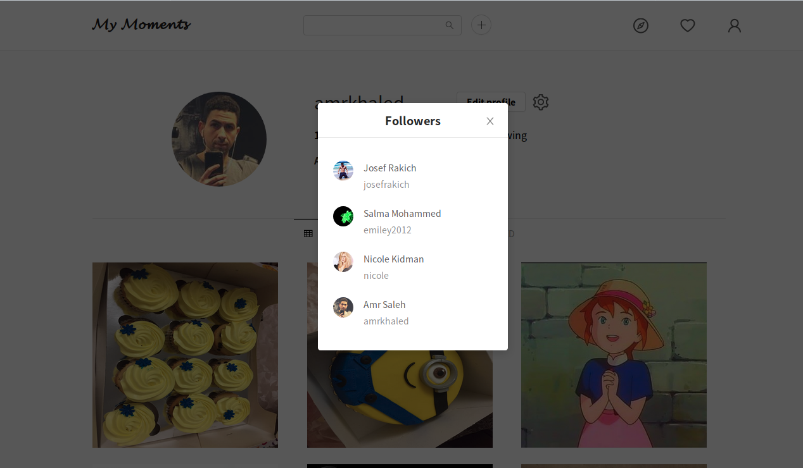
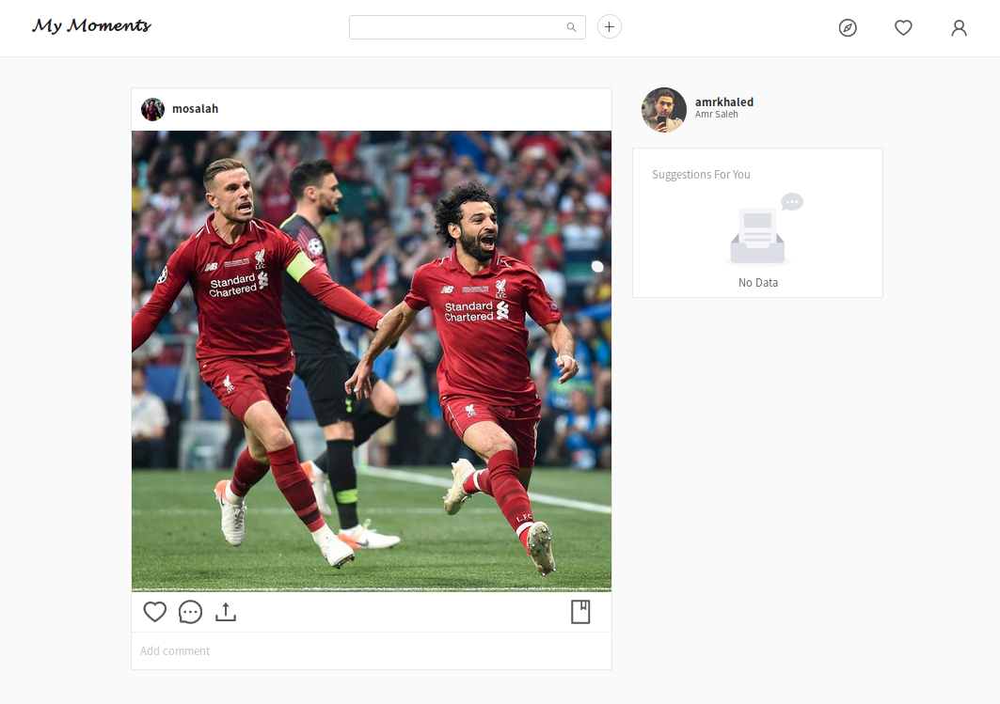
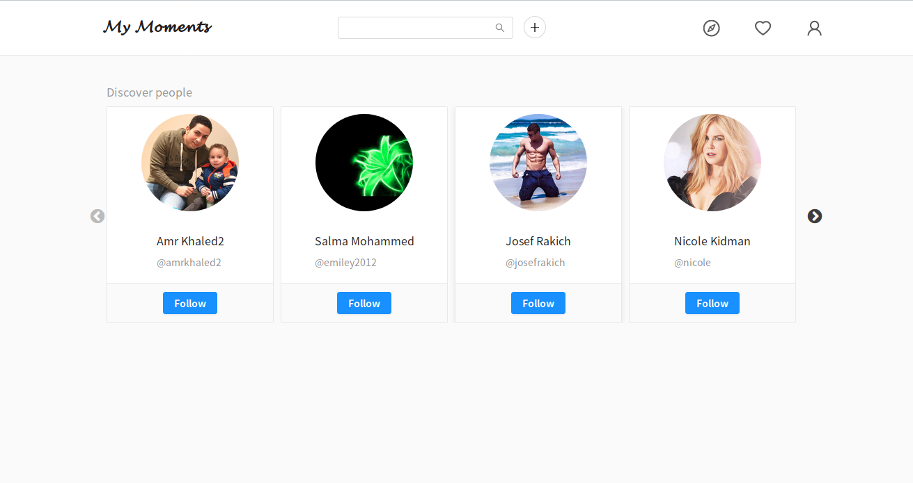

# my-moments
Instagram Clone - Cloning Instagram for learning purpose 

# What am I doing?
Instagram is will known for everybody but I'm cloning the basic features of Instagram and other social networks.
  - User have a profile
  - User can follow other users
  - User can see his followers and following
  - User can create a new post (images only)
  - User can see posts from users he is following (News feed)
  - User get notified when others follow him, comment or like his post
  - User can search for other Users
  
  
# Screenshots

This will be updated later but for now I wil add some screenshots of the progress

